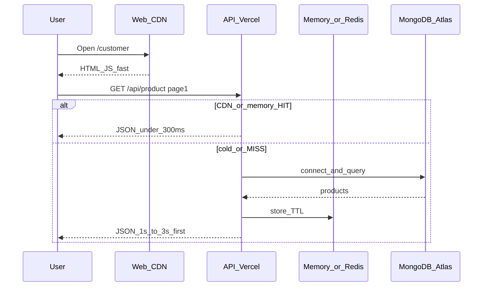

# Live API, response flow & how many users we can handle

Simple guide for the live MultiCommerce site: how a request moves, how long it takes, and how many shoppers can use the site at once.

---

## 1. Live URLs

| What | URL |
|------|-----|
| Website | https://multicommerce-web.vercel.app |
| API | https://multicommerce-api.vercel.app |
| Health | https://multicommerce-api.vercel.app/health |
| Products (page 1) | https://multicommerce-api.vercel.app/api/product?status=active&page=1&limit=12 |
| Categories | https://multicommerce-api.vercel.app/api/category |

Frontend calls the API using `VITE_API_URL` → `https://multicommerce-api.vercel.app/api`.

---

## 2. Simple flow (what a customer sees)

```text
Customer opens site
        │
        ▼
  Website (Vercel CDN) loads HTML/JS   ≈ 50–400 ms
        │
        ▼
  Browser asks API for products / categories
        │
        ├── First hit after long idle (cold)  →  ~1–3 seconds
        ├── Warm or cached hit                →  ~30–300 ms
        └── Reload with local shop cache      →  UI paints instantly, then quietly refreshes
        │
        ▼
  Page shows products · cart · checkout · orders
```

**One sentence:** the website is the storefront; the API is the brain + database; Redis/memory/CDN make repeated reads fast.

---

## 3. Detailed live response flow



### Step-by-step timing (measured on live API)

Times vary by region and cold start. Snapshot taken from production:

| Step | Call | Typical time | Notes |
|------|------|--------------|--------|
| 1 | `GET /health` (cold-ish) | ~400 ms | Wakes function; DB may still be connecting |
| 2 | `GET /health` (warm) | ~300–400 ms | `"db":"connected"`, `"redis":"memory"` |
| 3 | `GET /api/product?...limit=12` (MISS) | ~0.7–1.5 s (or 2–3 s if fully cold) | Reads Mongo, fills cache |
| 4 | Same products again (HIT) | **~30–280 ms** | Memory / CDN cache |
| 5 | `GET /api/category` (HIT) | **~30–250 ms** | Cached categories |

**Target for a good browse experience:** warm catalog APIs **under ~300 ms**.  
**Cold first visit after long idle:** can still be **2–3 seconds** on free Vercel serverless — reduced by the **Keep API warm** GitHub Action (every 5 minutes) and by **localStorage shop cache** on reload.

---

## 4. Simple API map (most used)

All shop APIs sit under `/api`.

### Public (no login)

| Method | Path | Use |
|--------|------|-----|
| GET | `/health` | Is API + DB up? |
| GET | `/api/product?status=active&page=1&limit=12` | Product list (paginated) |
| GET | `/api/product/search?keyword=pad&page=1&limit=12` | Search |
| GET | `/api/product/:id` | Product detail |
| GET | `/api/category` | Categories |
| GET | `/api/banner` | Home banners |
| GET | `/api/coupon/active` | Public coupons |
| POST | `/api/auth/register` | Sign up |
| POST | `/api/auth/login` | Login |
| POST | `/api/auth/verify-email` | OTP |

### Customer (login JWT)

| Method | Path | Use |
|--------|------|-----|
| POST | `/api/order/create` | Place order |
| GET | `/api/order/...` | My orders |
| GET/POST | `/api/address/...` | Addresses |
| GET/POST | `/api/review/...` | Reviews |
| POST | `/api/chat/...` | Support chat |

### Vendor / Admin

| Area | Base path | Role |
|------|-----------|------|
| Vendor auth | `/api/vendor/auth/...` | Seller login |
| Admin auth | `/api/admin/auth/...` | Admin login |
| Products CRUD | `/api/product/...` | Vendor manages catalog |
| Store | `/api/store/...` | Vendor store |
| Dashboard | `/api/dashboard/...` | Admin stats |

Full technical map: [04-API-MODULES.md](./04-API-MODULES.md).

### Example product list response

```http
GET /api/product?status=active&page=1&limit=12
```

```json
{
  "data": [ { "_id": "...", "name": "...", "price": 699, "discountPrice": 399 } ],
  "page": 1,
  "limit": 12,
  "total": 155,
  "totalPages": 13
}
```

Header on browse APIs: `X-Cache: HIT|MISS` and `Cache-Control` with `s-maxage` for CDN.

---

## 5. How many users at one time?

Numbers from **live load tests** (many people opening the product list together) plus architecture limits.

| Scenario | Concurrent users | What happens |
|----------|------------------|--------------|
| Comfortable browsing | **~25–50** | Usually smooth on current free Vercel + Atlas |
| Busy demo / class | **~50–75** | Works; some responses slower |
| Hard burst (measured) | **~100** | Still 100% success in test; p95 can rise to ~10–14 s without Redis host |
| Goal with Docker + Redis + stronger Atlas | **~ thousands up to ~5000 browse** | See [10-SCALE-5000-USERS.md](./10-SCALE-5000-USERS.md) |

### Plain language

- **Registered accounts:** MongoDB can store many thousands; that is not the same as “online at the same second.”
- **Online at the same time (today’s live free hosting):** plan for about **25–50 shoppers browsing together** for a good experience.
- **100 at once:** site can stay up, but some users wait longer if everything is cold / uncached.
- **5000 at once with no lag:** needs **always-on API containers + Redis + better Atlas**, not free serverless alone.

### What helps more users stay fast

1. Memory / Redis cache + CDN (`s-maxage`)  
2. Pagination (`page` / `limit`) — don’t send whole catalog  
3. Keep-warm cron every 5 minutes  
4. Instant UI from localStorage on reload  
5. `docker compose` API + Redis when you outgrow Vercel free  

---

## 6. How to re-check live speed yourself

```bash
# Warm / health
curl -s -w "\nTIME %{time_total}s\n" https://multicommerce-api.vercel.app/health

# Products twice (2nd should be much faster)
curl -s -w "\nTIME %{time_total}s\n" \
  "https://multicommerce-api.vercel.app/api/product?status=active&page=1&limit=12" -o /dev/null
curl -s -w "\nTIME %{time_total}s\n" \
  "https://multicommerce-api.vercel.app/api/product?status=active&page=1&limit=12" -o /dev/null
```

Or open DevTools → Network → reload `/customer` and look at `/api/product` duration.

---

## 7. Related docs

| Doc | Topic |
|-----|--------|
| [04-API-MODULES.md](./04-API-MODULES.md) | Full API module map |
| [07-PERFORMANCE-VERCEL.md](./07-PERFORMANCE-VERCEL.md) | Free Vercel tips |
| [10-SCALE-5000-USERS.md](./10-SCALE-5000-USERS.md) | Redis + Docker path to ~5000 |
| [CUSTOMER.md](./user-guides/CUSTOMER.md) | How customers use the shop |

---

*Last verified against live production timings; cold starts and region still affect the first hit after idle.*
