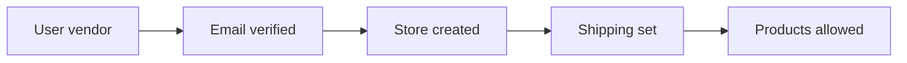

# Vendor Schema Design & Workflows

**Audience:** product & engineering  
**Basis:** [SYSTEM-DESIGN.md](./SYSTEM-DESIGN.md) · [SERVICES-CATALOG.md](./SERVICES-CATALOG.md) · [03-DATABASE-MODULES.md](../03-DATABASE-MODULES.md)  
**Code:** `backend/models/*.js`

This document has two parts:

1. **Schema design workflow** — how to change vendor-related schemas safely  
2. **Schema + data workflows** — current ER, key fields, and how records move through seller jobs  

---

## Part A — Schema design workflow

Use this process before adding or changing collections for vendor features (Waves A–E).

```text
① Capture need          ② Map to domain         ③ Design fields
   SERVICES-CATALOG        SYSTEM-DESIGN            types, enums,
   / PLANNING wave         Identity|Catalog|…       indexes, ownership

④ Choose change type    ⑤ Document here         ⑥ Implement
   extend field |          ER + workflow            model → API → UI
   new collection |        + migration note
   denormalize

⑦ Verify tenancy        ⑧ Update docs
   vendor/store filters    SERVICES-CATALOG status
   no cross-tenant leak    03-DATABASE-MODULES
```

### Step checklist

| Step | Do | Done when |
|------|----|-----------|
| 1. Need | Link wave item (e.g. A1 tracking) | Acceptance in PLANNING clear |
| 2. Domain | Pick Identity / Catalog / Inventory / Fulfillment / Money / Engage | Matches SYSTEM-DESIGN §4 |
| 3. Fields | Name, type, enum, default, required | Ownership field present (`store` / `vendor` / `storeId`) |
| 4. Change type | Prefer **extend existing** over new collection | Justify new collection if ledger/history |
| 5. Indexes | Queries vendors run daily | `(storeId, createdAt)`, `(vendor, status)`, uniques documented |
| 6. Workflow | State machine or write path | Diagram in this file |
| 7. API | Who can mutate; ownership check | `authorize('vendor')` + store match |
| 8. Ship docs | Flip Have/Partial in catalog | This file + `03-DATABASE-MODULES` updated |

### Design rules

1. **Tenant key on every vendor-owned doc** — `vendor` and/or `store` / `storeId`.  
2. **Snapshots at checkout** — order keeps price, address, coupon code; don’t live-link mutable product price.  
3. **Enums over free strings** for status fields.  
4. **Soft hide** with `status` / `isActive` before hard delete when shop-visible.  
5. **Money fields are server-written only** — not trusted from client body.  
6. **New money ledgers (payouts)** = new collection; don’t overload `paymentStatus` on Order to mean “vendor paid out.”

### Change-type guide

| Situation | Prefer |
|-----------|--------|
| Extra attribute on order/store/product | Add field on existing schema |
| Status pipeline already exists | Extend enum + document transitions |
| Audit trail (stock adjusts, payouts) | New collection |
| Cross-cutting platform config (commission %) | Admin settings / config doc — not on Store |
| Heavy read denorm (ratings) | Keep on Product; update on review write |

---

## Part B — Current schema (vendor scope)

### B1. Entity relationship (vendor lens)

```text
┌──────────────┐ 1        1 ┌──────────────┐
│ User         │────────────│ Store        │
│ role=vendor  │  vendorId  │ (UNIQUE)     │
└──────────────┘            │ shipping*    │
                            └──────┬───────┘
           ┌───────────────────────┼───────────────────────┐
           │                       │                       │
           ▼                       ▼                       ▼
    ┌──────────────┐        ┌──────────────┐        ┌──────────────┐
    │ Product      │        │ Coupon       │        │ Banner       │
    │ vendor+store │        │ store        │        │ store        │
    │ variants[]   │        └──────────────┘        └──────────────┘
    └──────┬───────┘
           │
           │ productId
           ▼
    ┌──────────────┐ 1    * ┌──────────────┐
    │ Order        │────────│ OrderItem    │
    │ storeId      │        │ price snap   │
    │ customerId   │        └──────────────┘
    └──────┬───────┘
           │
     ┌─────┴─────┐
     ▼           ▼
┌──────────┐ ┌──────────────┐
│ Review*  │ │ ChatSession  │
│ on Product│ │ storeId/order│
└──────────┘ └──────────────┘

Category (admin) ──► Product.category   (* Review by customer)
```

### B2. Collections & ownership

| Collection | Model | Tenant key | Vendor role |
|------------|-------|------------|-------------|
| `users` | `userModel` | self | Account |
| `stores` | `storeModel` | `vendorId` unique | Shop + shipping |
| `products` | `productModel` | `vendor`, `store` | Catalog + stock |
| `orders` / `orderitems` | `orderModel` | `storeId` | Fulfillment |
| `coupons` | `couponModel` | `store` | Discounts |
| `banners` | `bannerModel` | `store` | Home marketing |
| `reviews` | `reviewModel` | via product.store | Moderate |
| `chatsessions` | `chatSessionModel` | `storeId` | Support |
| `categories` | `categoryModel` | platform | Read-only pick |
| `addresses` | `addressModel` | customer | Snapshot into order |

---

## Part C — Field maps (vendor-critical)

### C1. Store

| Field | Type | Workflow use |
|-------|------|--------------|
| `vendorId` | ObjectId → User | Ownership; one store |
| `storeName`, `description`, contact, `address` | mixed | Profile |
| `shippingFee`, `freeShippingAbove` | Number | Checkout pricing |
| `estimatedDeliveryDays`, policies | Number/String | Display / trust |
| `isActive` | Boolean | Visibility |

**Target (planning):** `lowStockThreshold`, `gstin`, `bankAccount`, `ifsc`, `kycStatus`, `logo`.

### C2. Product (+ variant)

| Field | Type | Workflow use |
|-------|------|--------------|
| `vendor`, `store` | ObjectId | Tenant |
| `category` | ObjectId | Admin taxonomy |
| `name`, copy, `images` | … | Listing |
| `price`, `discountPrice` | Number | Sell price (server) |
| `stock` | Number | Base inventory |
| `variants[]` | sku, options, price, stock | Per-option inventory |
| `status` | `active` \| `inactive` | Publish workflow |

### C3. Order

| Field | Type | Workflow use |
|-------|------|--------------|
| `orderNumber` | String | Human id |
| `customerId`, `storeId` | ObjectId | Buyer / seller |
| `shippingAddress` | embedded | Snapshot |
| money fields | Number | Server-priced |
| `couponCode` | String | Snapshot |
| `paymentStatus` | enum | Money state |
| `paymentMethod` | enum | COD / online |
| `orderStatus` | enum | Fulfillment state |
| gateway ids | String | Razorpay |

**Target (A1):** `carrier`, `trackingId`, `shippedAt`.

### C4. Chat session

| Field | Type | Workflow use |
|-------|------|--------------|
| `customerId`, `storeId`, `orderId` | ObjectId | Scope |
| `topic`, `status` | enum | Inbox triage |
| `messages[]` | embedded | customer / bot / vendor |

---

## Part D — State & write workflows

### D1. Vendor onboarding (schema writes)

```text
POST /vendor/auth/register
    → User { role: vendor, isEmailVerified: false, otp… }

POST /auth/verify-email
    → User.isEmailVerified = true

POST /vendor/auth/login
    → User.refreshToken, lastLogin

POST /store (create)
    → Store { vendorId }   ← BLOCK products until this exists

PUT /store (shipping)
    → Store.shippingFee, freeShippingAbove, policies…
```



### D2. Product publish workflow

```text
inactive (draft) ──save Active──► active (shop visible)
active ──Mark inactive──► inactive (hidden, stock kept)
active/inactive ──Delete──► removed (bulk delete)
```

```text
Create/Update product
    → Product { vendor, store, stock | variants[].stock, status }
Bulk import
    → many Product rows (same ownership)
Order create (customer)
    → decrement Product/variant stock (server)
```

### D3. Order fulfillment workflow (`orderStatus`)

```text
                    ┌──────────┐
         ┌─────────►│Cancelled │
         │          └──────────┘
         │
Pending ─┴► Confirmed ► Processing ► Shipped ► Delivered
                                              │
                                              ▼
                                         Returned
```

| From | Allowed to (typical) | Schema side effects |
|------|----------------------|---------------------|
| Pending | Confirmed, Cancelled | — |
| Confirmed | Processing, Cancelled | — |
| Processing | Shipped, Cancelled | **Target:** set `carrier`, `trackingId`, `shippedAt` on Shipped |
| Shipped | Delivered | — |
| Delivered | Returned | Offline refund note; payment not auto-Refunded |
| Cancelled / Returned | (terminal) | — |

Invoice PDF: allowed when `orderStatus === Delivered` (platform rule).

### D4. Payment workflow (`paymentStatus`)

```text
Checkout
  COD     → paymentStatus = Pending  → vendor marks Paid (cash collected)
  Razorpay→ verify signature         → Paid (+ paymentId, paidAt)

Paid ──mark──► Refunded   (manual today; webhook target Wave C)
Pending ──► Failed        (online attempt failed)
```

**Important:** `paymentStatus` = **customer payment to platform/store order**, not vendor payout.

### D5. Checkout write path (creates vendor work)

```text
Customer cart (client) → POST /order/create (per store)
    1. Load products by store; verify ownership of lines
    2. Recalculate subtotal, tax, shipping (from Store), coupon
    3. Insert Order + OrderItems (price snapshots)
    4. Decrement stock on Product / variant
    5. paymentStatus Pending|Paid; orderStatus Pending
    → Vendor sees row on GET /order/store/:storeId
```

### D6. Coupon & banner workflows

```text
Coupon:  create (store) → isActive → validate at checkout → usedCount++
Banner:  create (store, type, image) → isActive + schedule → shop home CMS
```

### D7. Support chat workflow

```text
Customer opens help → ChatSession { storeId?, orderId?, status: open }
    → messages (customer/bot)
Vendor inbox → reply (role: vendor) → resolve (status: resolved)
```

### D8. Review workflow

```text
Customer posts Review { product, customer, rating }  (unique pair)
    → Product.averageRating / totalReviews updated
Vendor lists via product.store scope → may DELETE inappropriate
Target D3: Review.vendorReply + repliedAt
```

---

## Part E — Target schema (planning waves)

Do not implement until the wave is chosen; design is locked here for planning.

### E1. Wave A — Fulfillment & alerts

```text
Order += {
  carrier: String | null,
  trackingId: String | null,
  shippedAt: Date | null
}

Store += {
  lowStockThreshold: Number  // default 10
}
// optional later: Product.lowStockThreshold override
```

**Workflow change:** transition → `Shipped` may require or accept tracking fields; customer order UI reads them.

### E2. Wave B — Inventory ops

```text
StockAdjustment {
  _id,
  store: ObjectId,
  vendor: ObjectId,
  product: ObjectId,
  variantSku: String | null,
  delta: Number,          // +10 / -2
  reason: String,
  createdBy: ObjectId,
  createdAt
}
Index: (store, createdAt), (product, createdAt)
```

**Workflow:** `PATCH stock` → update Product/variant.stock → insert StockAdjustment.

### E3. Wave C — Money

```text
Store += {
  gstin, bankAccount, ifsc,
  kycStatus: enum Pending|Submitted|Verified|Rejected
}

// Platform config (admin)
Settings.commissionPercent: Number

Payout {
  store, vendor,
  periodFrom, periodTo,
  grossAmount, commissionFee, netAmount,
  status: enum Pending|Processing|Paid|Failed,
  paidAt, note
}
Index: (store, periodFrom), (status, createdAt)
```

**Workflow:** period close → create Payout Pending → admin marks Paid.  
Order.`paymentStatus` unchanged meaning.

### E4. Wave D — Insights & reviews

```text
Review += { vendorReply: String, repliedAt: Date }

// Stats: prefer aggregation API over new collection
// Optional cache later: VendorStatsDaily { store, date, revenue, orders }
```

---

## Part F — Index & query patterns (vendor)

| Vendor job | Query pattern | Index |
|------------|---------------|-------|
| My products | `{ store, status }` | `store + status` |
| Inventory / alerts | products by store; filter stock ≤ threshold | `store`; stock scan or dedicated field later |
| Orders list | `{ storeId }` sort `createdAt` | `storeId + createdAt` |
| Orders by status | `{ storeId, orderStatus }` | add compound if needed |
| Coupons | `{ store }` | store |
| Chat inbox | `{ storeId }` sort `lastMessageAt` | `storeId + lastMessageAt` |
| Reviews manage | products of store → reviews by product ids | product ref |

---

## Part G — Schema ↔ portal map

| Portal area | Primary collections | Workflow section |
|-------------|---------------------|------------------|
| Overview | Order, Product (aggregate) | D3–D5; target D1 API |
| Store / Shipping | Store | D1 |
| Products / table | Product | D2 |
| Inventory / alerts | Product (+ Store threshold) | D2, E1–E2 |
| Orders | Order, OrderItem | D3, D5 |
| Payments | Order.paymentStatus | D4; E3 Payout later |
| Coupons | Coupon | D6 |
| Marketing | Banner | D6 |
| Support | ChatSession | D7 |
| Reviews | Review, Product | D8 |

---

## Related documents

| Doc | Role |
|-----|------|
| [SYSTEM-DESIGN.md](./SYSTEM-DESIGN.md) | Architecture & domains |
| [PLANNING.md](./PLANNING.md) | When to build each schema extension |
| [SERVICES-CATALOG.md](./SERVICES-CATALOG.md) | Requirement status |
| [03-DATABASE-MODULES.md](../03-DATABASE-MODULES.md) | Full platform field tables |
| [02-PROJECT-FLOW.md](../02-PROJECT-FLOW.md) | End-to-end product flows |
